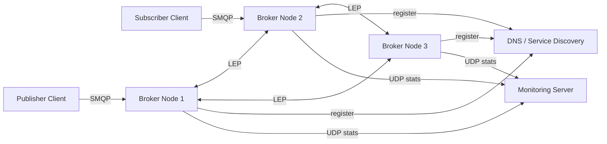
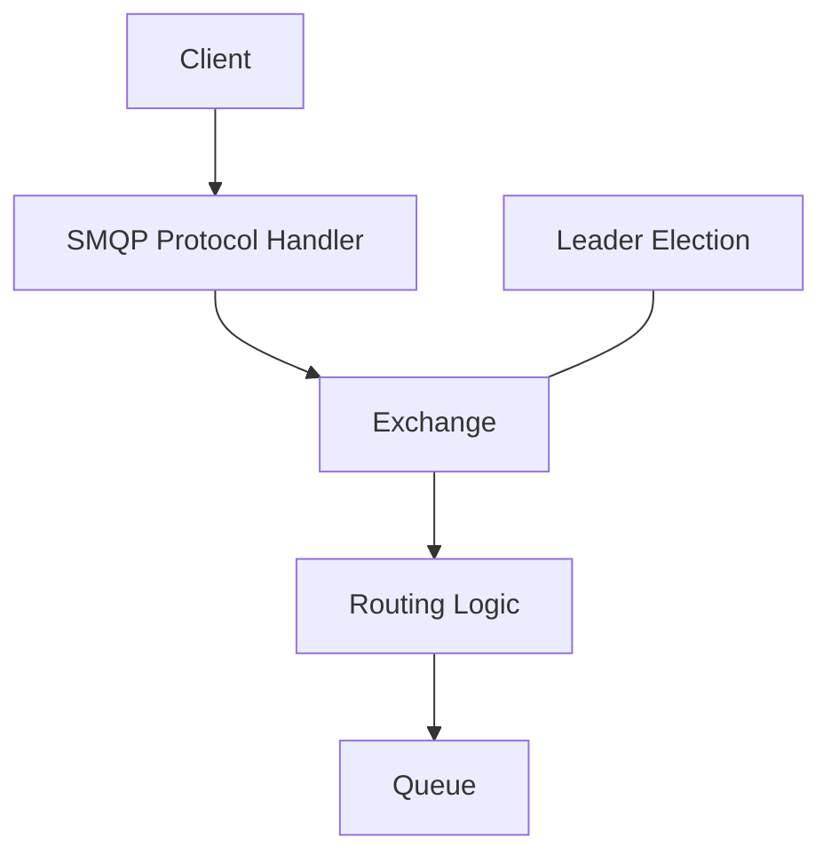
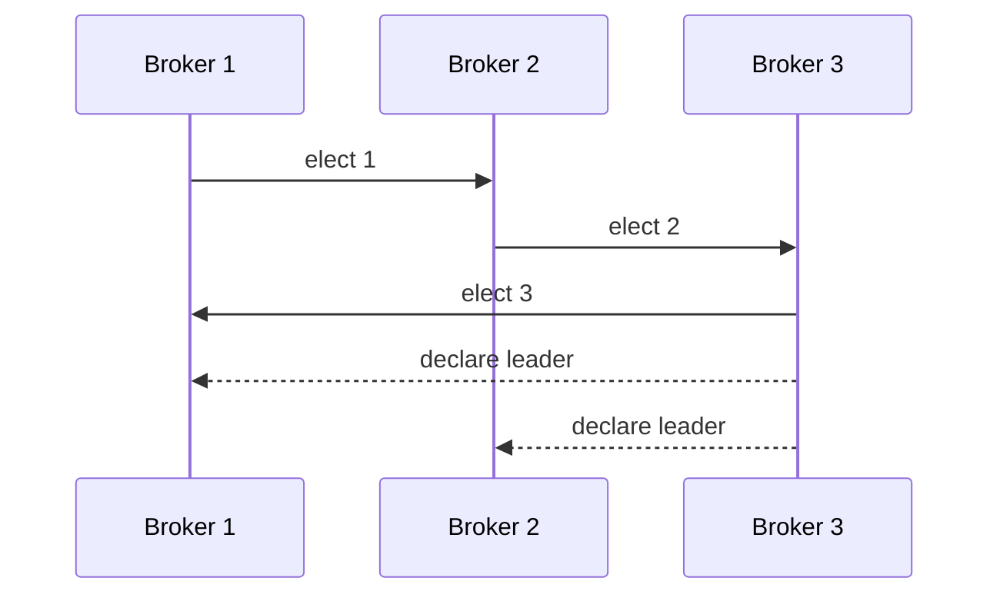

# Distributed Broker & Leader Election System

A Java-based **distributed messaging system** that combines a message broker,
topic routing with wildcards, distributed service discovery, and multiple
leader election algorithms.

The system demonstrates core distributed systems concepts such as:

- distributed message routing
- service discovery
- leader election
- failure detection with heartbeats
- monitoring with UDP
- custom TCP protocols
- concurrent network servers

The architecture resembles simplified concepts used in systems like
RabbitMQ, Kafka, or distributed coordination services.

---

# System Architecture

The system consists of several cooperating components:

- **Clients** that publish or subscribe to messages
- **Broker nodes** that route and deliver messages
- **DNS / Service Discovery server** used by brokers
- **Monitoring server** collecting routing statistics

Each broker can operate independently but also cooperates with other brokers
in a cluster to elect a leader and coordinate system behavior.

---

# Broker Architecture

Each broker contains several internal components responsible for
handling client communication, routing messages, and participating in
cluster coordination.

Responsibilities of a broker:

- receive messages from clients via SMQP
- manage exchanges and queues
- route messages using routing keys
- deliver messages to subscribed clients
- participate in leader election
- register its address via service discovery
- report message statistics to the monitoring server

---

# Exchange Types

The broker supports multiple exchange types similar to RabbitMQ.

| Exchange | Description |
|--------|-------------|
| direct | routes messages using exact routing keys |
| fanout | broadcasts messages to all queues |
| topic | routes messages using wildcard patterns |
| default | implicit direct exchange |

---

# Wildcard Topic Routing

Topic exchanges support wildcard routing patterns.

| Wildcard | Meaning |
|--------|---------|
| * | matches exactly one word |
| # | matches zero or more words |

Example:

Publisher routing key:

hotel.room.duvet

Subscriber binding:

hotel.*.duvet

Result:

hotel.room.duvet → delivered  
hotel.bed.duvet → delivered  
hotel.room.clean → ignored

---

# Message Flow

The following diagram shows how a message travels through the system.

1. A publisher sends a message to the broker.
2. The message is received by an exchange.
3. The exchange forwards the message to the routing logic.
4. The router determines the correct queue using routing keys.
5. The message is delivered to subscribers.

---

# Leader Election

Broker nodes form a distributed cluster and must agree on **exactly one leader**.

The leader is responsible for registering the active broker address via
service discovery and coordinating cluster state.

Brokers communicate using a custom **Leader Election Protocol (LEP)**.

Each broker can be in one of three states:

- follower
- candidate
- leader

---

# Heartbeat Mechanism

The leader periodically sends heartbeat messages to followers.

Leader → ping  
Follower → pong

If a follower does not receive a heartbeat within a configured timeout:

1. the follower assumes the leader failed
2. an election is started
3. a new leader is chosen

---

# Leader Election Algorithms

The cluster supports three election algorithms.

| Algorithm | Description |
|---------|-------------|
| Bully | node with highest ID becomes leader |
| Ring | election message circulates in a ring |
| Raft-style | voting based leader election |

Example election flow:

---

# Monitoring Server

The system includes a **UDP-based monitoring server** that collects
statistics about messages routed by the broker nodes.

Whenever a broker routes a message, it sends a small monitoring packet
containing its address and the routing key.

UDP is used because monitoring data is **non-critical** and should not
delay normal broker communication.

---

# Custom Network Protocols

The system defines three lightweight text-based protocols.

| Protocol | Purpose |
|--------|--------|
| SMQP | client ↔ broker messaging |
| LEP | broker ↔ broker leader election |
| SDP | service discovery / DNS |

Example publish message:

PUBLISH
exchange: hotel-events
routing-key: hotel.room.duvet
payload: "new duvet delivered"

Broker response:

OK
message routed

---

# Running the Application

## Build

Using Gradle:

./gradlew build

Windows:

gradlew build

---

## Run

java -jar build/libs/<jar-file>.jar

The application can run in different modes:

- broker node
- DNS / service discovery server
- monitoring server
- client

Multiple brokers can run simultaneously to form a cluster.

---

# Running Tests

Run the test suite with:

./gradlew test

---

# Concepts Demonstrated

This project demonstrates core distributed systems concepts:

- distributed messaging systems
- leader election algorithms
- service discovery
- failure detection
- wildcard topic routing
- TCP and UDP protocol design
- concurrent server architectures

# Technologies

| Technology | Purpose |
|-----------|--------|
| Java 21 | Core implementation |
| Gradle | Build system |
| TCP Sockets | Client and broker communication |
| UDP | Monitoring statistics |
| Concurrent Programming | Multi-client handling |
| Distributed Algorithms | Leader election |

